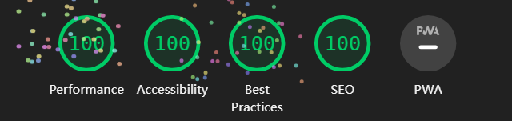

# RefactX Project

A minimal, SEO-friendly portfolio and blog theme for Astro, supports Vue and UnoCSS.

## Preview

## Features

- 100 / 100 Lighthouse performance.
- Responsive.
- SEO-friendly.
- Light / Dark Theme.
- Markdown support.
- [MDX](https://mdxjs.com/) (components in your markdown) support.
- [Vue](https://vuejs.org/) SFC component support.
- Auto generated sitemap and RSS Feed [VueUse](https://vueuse.org/) & [Lodash](https://lodash.com/) support.
- Use the [UnoCSS](https://unocss.dev/) for style, it's fast.

## Lighthouse Performance

## License

[MIT License](./LICENSE) © 2024 [Kieran Wang](https://github.com/kieranwv/)
